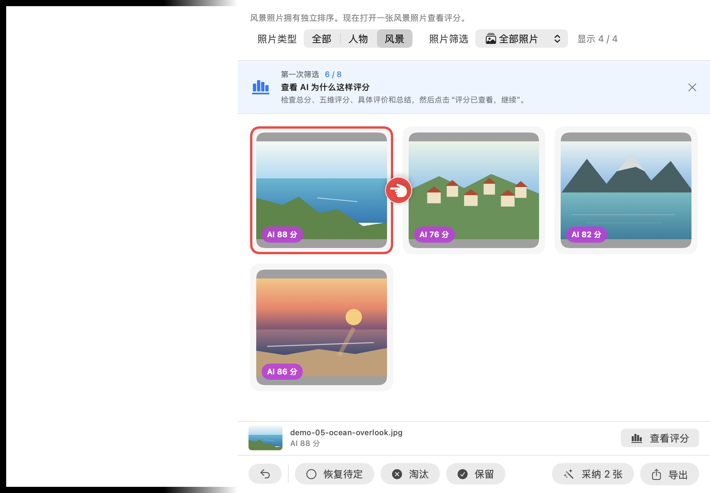

# 旅行照片筛选器

一次旅行拍了几千张，从里面挑出真正值得留下的十几张。

一个 macOS App。照片不上传、不外传，全部在你自己的电脑上处理；
原图只读，导出只复制。

---

## 下载与安装

到 **[Releases 页面](https://github.com/tanweiping1012-source/PhotoFilter/releases/latest)**
下载 `TravelPhotoFilter-<版本>-macOS-universal.dmg`（约 3 MB，Apple Silicon 与 Intel 通用）。

1. 双击 `.dmg`，把「旅行照片筛选器」拖进「应用程序」。
2. 在「应用程序」里打开它。

> **第一次打开会被系统拦住。**
> 这个版本没有经过 Apple 公证，属于预期行为。
> 按住 **Control 点按** App 图标 → 选择「打开」；
> 如果仍被拦截，打开「系统设置 → 隐私与安全性」，在底部确认来源后选择「仍要打开」。

需要 macOS 14 或更高版本。不需要注册账号，不需要 API Key——没有 Key 时全部本地功能照常可用。

---

## 它解决什么问题

**旅行回来，照片躺在硬盘里再也没被打开过。**

不是因为懒。一次旅行拍下 5,000–10,000 张照片是常事，而"整理"这件事在第一分钟就会撞上三堵墙：

### 痛点一：同一个场景有七八张，你分不出哪张更好

站在同一个观景台，你连按了八下快门。八张照片在缩略图上**长得一模一样**——
差别是某一张对焦跑了、某一张有人闯进画面、某一张海平面歪了 2 度。

要发现这些差别，你得逐张点开、放大、来回切换。八张照片比完，你已经不想继续了，
而后面还有七十组这样的连拍。

### 痛点二：人物照和风景照混在一起，没法用同一把尺子挑

一张人像好不好，看的是**表情、姿态、有没有人闭眼、人和环境的关系**。
一张风景好不好，看的是**光线、层次、构图、氛围**。

这是两套完全不同的标准。混在一个列表里排序，等于逼你在"这张人像"和"这片晚霞"之间做一个
根本不存在的比较——于是你两个都留下了，然后什么都没筛掉。

### 痛点三：想让 AI 帮忙，但不想为几千张照片付钱

AI 确实能解释"为什么这张更好"。但如果把几千张原图直接丢给模型，你要同时承担两件事：

- **隐私**：几千张带人脸、位置、时间的原图，交给一个你不了解的服务；
- **费用**：图片是按尺寸计费的，几千张的量级足以让一次"整理照片"变成一笔真实开销。

关键在于：**这几千张里，绝大多数根本不值得让 AI 看。**
连拍的八张里有七张是重复的，你已经手动淘汰的那些更不用再问。

所以这个 App 的做法是**先在本机把范围收窄，再让 AI 看剩下的那几十张**：

- 同一组相似照片**只送一张代表**——不为八张几乎一样的照片付八次钱；
- 你已经保留或淘汰的照片**不再参与**；
- 候选池按"还差几张"弹性收敛（默认目标下最多 48 张），不为凑满上限加入弱候选；
- 图片按你选的档位重新编码（512 / 1024 / 1536px，默认最小的 512px），不发原图；
- 每次请求打包 2–5 张，摊薄提示词的固定开销。

一组实测数字：**421 张风景照片，AI 实际只评了 18 张**，
在最贵的 1536px 档位下累计约 4.2 万输入 token。
同样这批照片全部送进去，光输入就接近 100 万 token——差了 20 倍以上。
被漏斗挡掉的那 400 张里，绝大多数是同场景的重复和你已经决定过的照片，
让 AI 再看一遍它们，多半只是把同一个答案买两次。

---

## 它怎么解决

| 痛点 | 做法 |
|---|---|
| 连拍分不出好坏 | 本机感知指纹把画面相似的照片**收拢成一组**，组内按清晰度/反差/曝光排序，只让最稳的一张进入候选。你不用逐张比，只需要确认组代表 |
| 缩略图上看不出糊 | 后台在 512px 灰度图上算清晰度，**在同一组相似照片内做相对判断**——同场景里明显更糊的那张会被标出来，而本身细节就少的干净海景不会被误标 |
| 两类照片标准不同 | 用 Apple Vision 在本机分成**人物 / 风景两条独立赛道**，各自设定要留几张、各自排序、各自导出。不做跨类比较 |
| 不想上传、不想多花钱 | 先用本机漏斗把几千张收窄到几十张，AI 只看这几十张。每次最多 5 张、去掉 EXIF/GPS 的低清 JPEG（512/1024/1536px 由你选），发送前确认。自带 Key，只存本机 Keychain |

### 想用 AI 评分的话

AI 是可选的，用你自己的 Key：

1. 侧栏「AI评分设置」里先选**品牌**——火山方舟 / MiniMax / OpenAI / Anthropic / Google Gemini /
   阿里百炼 / xAI / Kimi / 智谱 GLM / 腾讯混元，或自己的 OpenAI-compatible 接口。
2. 再选该品牌下**支持图片输入**的具体模型，填入 API Key。
   App 会用一张内置测试图走完整的图片请求与评分契约**验证**，通过后才写入 Keychain。
3. 回到项目，点「开始人物 AI评分」或「开始风景 AI评分」。
   确认弹窗只有一句话：用哪个模型、给多少张、什么类型的照片打分。

跑完后 App 自动切到该类型的结果视图并给出回执，你看过之后点底部「采纳」。
评分期间只有**正在评分的那一类**被锁住，另一类照常可以浏览和决定。

### 一次完整的筛选长这样

```
选文件夹  →  0.1 秒后网格可见，后台继续分析
            ↓
        人物 / 风景自动分开，相似照片收拢成组，废片打上风险标记
            ↓
        过大图：P 保留 / X 淘汰 / U 待定 / ⌘Z 撤销
            ↓
      （可选）对某一类跑 AI 评分 → 自动跳到结果页 → 采纳
            ↓
        导出：复制到「人物」「风景」两个子目录 + selection.json / csv
```



> 上图是 App 内置的离线样例（8 张程序生成的示意图），第一次启动的教学就用它走完整流程——
> 不联网、不读 Keychain、不碰你的目录。

### 它不做什么

- **不替你做决定。** AI 评分只是紫色建议，保留、淘汰、导出永远需要你点。
- **不碰原图。** 全仓库只有两处写文件：你选的导出目录，和 App 自己的状态文件。
  没有任何删除、移动、改名、写回原图的代码路径。
- **不卖 API 额度。** 自带 Key（BYOK），App 内没有购买、充值或跳转购买的入口。
- **不在本机留下 AI 痕迹。** AI 请求走独立的临时会话：不写磁盘缓存、不存 Cookie、不留凭据。
- **不联网做本地筛选。** 扫描、分类、相似识别、技术分析、导出全部离线完成。

---

## 实现方式

macOS 14+ / SwiftUI / Swift 6.2 严格并发。无第三方依赖：图像走 ImageIO 与 Core Graphics，
本机识别走 Vision，网络走 URLSession。

### 关键设计：一张照片只解码一次

最初的实现为拍摄时间、感知指纹、清晰度、人物分类各解码一次原图。
40MP JPEG 上这意味着每张照片重复解码四次。

现在 `PhotoAnalysisPipeline` 打开一次 `CGImageSource`、解码一次 1024px 降采样图，
后续四项分析全部复用同一份像素。在 M 系列 8 核 / 475 张 40MP JPEG（9.4GB）上实测：

| 指标 | 数值 |
|---|---|
| 网格可见 | 0.1 s |
| 完整本地分析 | 约 52 s（并行 6 路，约 0.06 s/张） |
| 单张串行成本 | 0.244 s（原为 0.563 s） |

并发路数刻意小于核心数：Vision 内部已经会用到 GPU / ANE，开满只会互相排队并推高内存。

### 各步骤怎么做的

- **相似识别**：8×8 灰度感知哈希（64 位）+ 汉明距离。严格近重复（距离 ≤4）不要求时间接近；
  画面中等相似（距离 ≤14）必须同时满足拍摄时间相差 ≤120 秒。**时间只提高置信度，不能单独成组。**
- **清晰度**：512px 灰度图上的拉普拉斯响应，取最强 1% 边缘的均值除以画面反差。
  风险判定是**相对的**——参考值取同一相似组的中位数，没有组时才退回整库中位数并用更严的阈值。
- **人物 / 风景**：一个 `VNImageRequestHandler` 跑完人体框、人脸质量、人物分割、人物实例掩码、
  注意力显著性五个请求。"人物"要求人物承担主要视觉主题，远处路人和背景人群仍算风景。
- **AI 评分**：模型按固定绝对标尺对每张照片**独立**打分（80 分 = 专业摄影师水准），
  不做组内比较、不返回名次。名次由 App 在本机按总分和五维分排序产生。
  429 / 5xx / 断网按指数退避自动重试并遵守 `Retry-After`，鉴权和模型 ID 错误不重试。
- **供应商适配**：解析边界在协议 envelope 而不是模型。OpenAI / Gemini / Qwen / xAI / Kimi /
  GLM / 混元 / 自定义接口共用一个 OpenAI-compatible 适配器；方舟用 Responses API，
  Anthropic 用 Messages API。所有适配器最终都过同一个 `AestheticReviewValidator`。

### 从源码运行

需要 Xcode 26 / Swift 6.2。

```bash
scripts/run-app.sh
```

完整的验证、门禁、基准测试、DMG 打包与发布流程见[开发与发布](docs/engineering/DEVELOPMENT.md)。

---

## 文档

从 **[docs/README.md](docs/README.md)** 进入——按"我想了解产品 / 我要改代码 / 我要看隐私合规"分好了类。

- [产品说明](docs/product/OVERVIEW.md)：完整的产品行为定义
- [代码结构](docs/engineering/ARCHITECTURE.md)：模块地图与数据流
- [隐私政策](docs/privacy/PRIVACY_POLICY.md) 与 [App Store 隐私披露](docs/privacy/APP_STORE_PRIVACY.md)
- [项目规则](AGENTS.md)：改这个仓库前必读的硬约束

## 当前限制

- 没有经过 Apple 公证，首次打开需要手动放行。
- RAW 尚未支持；更强的图像向量相似度在后续里程碑。
- 只能选择文件夹，尚未接入系统「照片」图库。
- 本地分析进行中不能新建或切换项目——半分析状态无法安全保存。
- AI 评分的候选池上限随目标数量放宽，但单类目标超过 240 张时无法完全由 AI 填满。

## 许可

[MIT](LICENSE)
